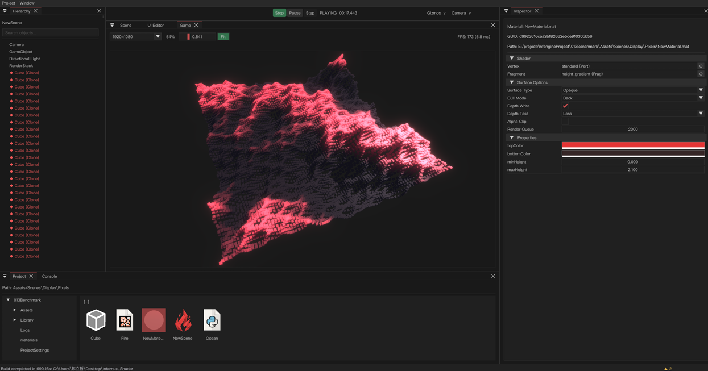

<p align="center"></p>

<h1 align="center">Infernux · 熔炉</h1>
<p align="center"><a href="https://github.com/ChenlizheMe/Infernux/releases"></a></p>
<p align="center"><strong>创造世界，让智能成为世界的一部分。</strong><br>以 Python 为主要创作语言，致力于成为 Neural Network-Native Engine。</p>

<p align="center">
  <a href="README.md">English</a> ·
  <a href="https://infernux-engine.com/">官网</a> ·
  <a href="https://infernux-engine.com/start.html">开始使用</a> ·
  <a href="https://infernux-engine.com/wiki.html">文档</a> ·
  <a href="https://infernux-engine.com/roadmap.html">路线图</a> ·
  <a href="https://infernux-engine.discourse.group/">社区</a>
</p>

Infernux 是一款开源游戏引擎，让你用熟悉的 Python 创造可以游玩的世界，并把 Python 的计算生态带进游戏。用 Python 编写玩法、编辑器工具和渲染管线；由 C++ 承担底层运行时，Vulkan 驱动原生图形，WebGPU 把作品带到浏览器。

我们的目标是 **Neural Network-Native Engine（3N）：神经网络原生引擎**，让神经网络从引擎设计开始就参与世界数据、计算和运行。模型能够观察世界、参与模拟，并成为最终游戏的一部分。这条路从完整的游戏开发能力出发，以明确、可检查的接口连接世界数据、神经计算与创作工具。

**MIT 开源协议。Windows、Linux 编辑器。Windows、Linux、Android、Web 四端 Player。** 引擎仍在积极开发；041 是当前开发主线，当前公开发布版本为 **0.4.1**。


*0.3.4 技术展示的真实截图：65,536 个普通 GameObject，配合 Python 编写的 RenderStack。*

## 今天就能创造的世界

### 从第一个组件，到你自己的工具，都用 Python

编写带 Inspector 字段、生命周期回调和协程的玩法组件；组织 Prefab，同时编辑多个场景，在编辑器运行时持续迭代。用自定义面板和多级菜单扩展工作流。项目脚本与插件组件共同进入事务式热重载流程。

渲染编排、资源流程和数值计算同样可以在 Python 中完成。CPU/GPU JIT 与 Taichi 集成让项目脚本执行数值计算，并将结果接入游戏逻辑。启动预热与构建准备将受支持的编译工作提前，减少第一次操作时的等待。

### 塑造画面，也掌握渲染管线

使用 PBR 材质、灯光、阴影、相机和后处理构建画面。用 Python 定义 RenderStack，由原生 RenderGraph 执行。引擎提供 Forward、Forward+、Deferred 渲染路径，以及模型、骨骼动画、GPU 粒子、屏幕 UI 和世界空间文本。

Vulkan 与 WebGPU 共用面向引擎的渲染接口。不同平台仍有真实的能力边界：浏览器的计算环境与 Python 扩展支持不同于桌面和 Android。目标平台的准备工作由引擎和平台插件承担，让游戏项目尽量共用创作代码。

### 把玩法组织成多个场景

一起编辑、加载和卸载场景，在场景间移动对象，并保留需要持续存在的对象。导入 FBX 与 Blender 内容，拆分网格、配置材质和贴图，同步外部源文件的修改。组合 Jolt 刚体、碰撞回调、动画、音频与交互 UI，通过 Scene/Game 视图、Gizmo、Hierarchy 和 Console 检查结果。

资源从导入、编辑到 Cook 始终保有 **GUID 身份**。Player 使用构建后的资源索引与封包，携带游戏真正需要的内容，不依赖编辑器里的项目目录布局。

### 让编辑器适应你的工作方式

InxPackage 插件可以包含组件、工具、资源和平台导出器。玩法放在 `runtime/`，创作工具放在 `editor/`，一般文件与它们并列。插件可以提供本地化面板和菜单，通过 `plugin_pages/` 提供编辑器内教程，并通过 Project/File Manager 的文件夹右键菜单打包成 `.inxpkg`。本地文件夹可用 `inx_package.json` 指定元数据，未提供时由导出器生成。GitHub 模板将分发内容放在 `package/` 中，独立打包脚本 `package.py` 放在包外。

可选 MCP 插件让 Agent 通过界面使用的同一套命令与撤销路径操作编辑器。自动化场景编辑、检查日志、捕获真实视口画面，同时保持操作可观察。

## 一个项目，多种游玩方式

| 平台 | 编辑器 | Player | 图形后端 |
| --- | --- | --- | --- |
| Windows x64 | 有 | 有 | Vulkan |
| Linux x86_64 | 有 | 有 | Vulkan |
| Android arm64/x86_64 | 无 | APK/AAB | Vulkan |
| Web | 无 | HTML/JS/WASM | WebGPU |

各平台的要求与限制见[平台支持说明](SUPPORT.md#platform-support)及[平台支持矩阵](docs/platform-support.json)。

各平台插件声明自己的构建选项，在编辑器中统一呈现，并提供对应运行时载荷。InfernuxHub 管理引擎安装、Python 环境和共享安卓工具。导出的 Player 包含运行时组件与资产，编辑器工具留在编辑器中。

## 041 带来了什么

041 主线深入完善日常开发流程：多场景编辑、模型导入与外部源同步、CPU/GPU JIT 准备、物理查询、世界 UI、更可靠的 Player 启动和场景切换，以及重新梳理的插件生命周期。

插件改进覆盖 Player 组件注册、已有组件行为的实时更新、面板与回调的明确清理、插件词条表，以及由平台插件拥有的构建设置。完整范围与升级说明见[中文更新日志](UpdateLog-zh.md)和[英文更新日志](UpdateLog.md)。

## 走向 3N

现在的引擎已经提供 Python 创作、原生渲染与模拟、批量世界数据 API、计算集成和可编程编辑器工具。接下来，这些基础将直接服务于神经网络系统：

| 方向 | 带来的能力 |
| --- | --- |
| 模型工作流与可移植推理 | 利用 Python 机器学习生态开发，按目标平台分发所需推理运行时。 |
| 统一世界 Schema | 让工具和模型准确理解世界状态与合法操作。 |
| 快照、增量与确定性回放 | 复现交互、诊断模拟，为学习任务提供可重复的环境。 |
| 批量世界与张量数据面 | 同时推进多个环境，高效交换模型与世界的数据。 |
| 有明确治理边界的工具与模型包 | 让扩展的能力、归属与生命周期随分发一同明确。 |

**这些是路线图目标，完整的神经网络训练与部署闭环仍在前方。** [路线图](https://infernux-engine.com/roadmap.html)列出了通往 0.5.2 的阶段。正确性、可观测性和明确的平台行为贯穿实现过程。

## 开始创作

安装 [InfernuxHub](https://infernux-engine.com/download.html)，选择引擎版本并创建项目。Hub 管理 Python 环境，使用编辑器无需先配置原生编译器。接下来可以阅读[学习指南](https://infernux-engine.com/learn.html)与 [API 文档](https://infernux-engine.com/wiki/site/en/api/index.html)。

插件作者入口：[创作指南](https://infernux-engine.com/wiki/site/en/plugin-package-content.html) · [插件模板](https://github.com/ChenlizheMe/infernux_plugin_template)。

### 从源码构建引擎

Windows 需要带 MSVC v143 的 Visual Studio 2022、CMake 3.25+、Vulkan SDK 与 Python 3.13 开发环境。通过 preset 构建并安装：

```powershell
git clone --recurse-submodules https://github.com/ChenlizheMe/infernux.git
cd Infernux
./scripts/setup/configure_development.ps1
conda activate infernux
cmake --preset windows-msvc-release
cmake --build --preset windows-msvc-release
cmake --build --preset windows-msvc-install-wheel
python packaging/launcher.py
```

Linux 先运行 `scripts/setup/install_linux_dependencies.sh` 安装原生依赖，再运行 `bash scripts/setup/configure_development.sh`，激活 `infernux`，使用 `linux-clang-release` 配置和构建 preset，最后运行 `linux-clang-install-wheel`。preset 选择匹配的配置并安装打包后的引擎；开发细节见 [CONTRIBUTING.md](CONTRIBUTING.md)。

## 加入熔炉

做一款游戏，分享一个插件，或展示你希望改进的工作流。欢迎在[社区](https://infernux-engine.discourse.group/)讨论和展示作品，在 [GitHub](https://github.com/ChenlizheMe/Infernux/issues) 提交可复现的问题，也欢迎参与引擎、文档和示例的建设。

Infernux 使用 [MIT 协议](LICENSE)。[SignPath.io](https://signpath.io/) 提供免费代码签名，[SignPath Foundation](https://signpath.org/) 提供证书，详见[代码签名政策](CODE_SIGNING_POLICY.md)。

## 引用

```bibtex
@software{chen2026infernux,
  author  = {Chen, Lizhe},
  title   = {Infernux},
  year    = {2026},
  version = {0.4.1},
  url     = {https://github.com/ChenlizheMe/Infernux}
}
```
