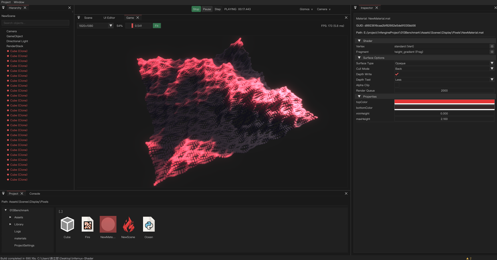

<p align="center">
  
</p>

<h1 align="center">Infernux · 熔炉</h1>

<p align="center">
  <strong>C++ / Vulkan / WebGPU runtime. Python is the real development interface.</strong>
</p>

<p align="center">
  <a href="LICENSE"></a>
  
  
  
  
  
</p>

<p align="center">
  <a href="README-zh.md">简体中文</a> ·
  <a href="https://infernux-engine.com/">Website</a> ·
  <a href="https://infernux-engine.com/wiki.html">Documentation</a> ·
  <a href="https://infernux-engine.discourse.group/">Forum</a> ·
  <a href="https://github.com/ChenlizheMe/Infernux/releases">Releases</a>
</p>

<p align="center">
  
</p>

This is a real editor capture from the 0.3.4 showcase: 65,536 ordinary GameObjects, one mesh, one material, and a RenderStack doing lighting, fog, color, tilt-shift, and MSAA.

## What this is

A general-purpose game engine. Not a chat box glued onto someone else's editor.

The runtime is C++17, with Vulkan on native platforms and WebGPU in browsers. Gameplay, components, editor tools, assets, and render setup are written in Python 3.13.

**0.4.0** brings Windows and Linux Editors, Windows/Linux/Android/Web Player builds, self-contained plugin payloads, packed runtime assets, and Hub-managed build environments. The same project is used to exercise gameplay, UI, input, and packaged file access across the four Player targets.

## What you can do now

- Scenes, components, physics, audio, UI, animation, particles, prefabs
- Vulkan Forward / Forward+ / Deferred, PBR, RenderGraph, RenderStack
- Windows and Linux Hub, Editor, and standalone Player builds
- Android APK/AAB and Web Player exports through the same build service
- InxPackage plugins with runtime/editor separation and live asset and script refresh
- Path-based asset access backed by GUIDs and packed Player content
- Hub-managed Python and Android support, with background installation queues

| Target | Editor | Player | Graphics | 0.4.0 status |
|---|---:|---:|---|---|
| Windows x64 | Yes | Yes | Vulkan | Build and CI passed |
| Linux x86_64 | Yes | Yes | Vulkan | Build and CI passed |
| Android arm64/x86_64 | No | APK/AAB | Vulkan | Build and CI passed |
| Web | No | HTML/JS/WASM | WebGPU | Build and CI passed |

This table follows the [auditable support matrix](docs/platform-support.json).
[Evidence and release boundaries](SUPPORT.md#platform-support) distinguish CI
acceptance from public release availability and device coverage. macOS and native
iOS are not supported targets.

Platform exporters are official InxPackages with independent repositories and releases: [Windows](https://github.com/ChenlizheMe/infernux_windows), [Linux](https://github.com/ChenlizheMe/infernux_linux), [Android](https://github.com/ChenlizheMe/infernux_android), and [Web](https://github.com/ChenlizheMe/infernux_web). Each repository includes illustrated setup documentation and an installable `.inxpkg` release asset.

Each platform plugin carries its precompiled Player and target-specific runtime or build tools. Normal game exports use the installed engine and plugins; they do not require an engine source checkout, Git submodules, CMake, or native engine compilation. For Android, first install **Android support** under Hub's **Installs** page, then import the Android plugin. Hub owns the shared SDK, NDK, JDK, Gradle, and target Python dependencies and supplies their paths to the Editor. OpenGL, OpenGL ES, and WebGL are not fallback product paths.

MCP is distributed as the official default plugin [`infernux/mcp`](https://github.com/ChenlizheMe/infernux_mcp). New projects include it, and projects that do not need agent access can disable or uninstall it independently of the engine.

Animation-only FBX files can drive a matching skinned model without geometrically guessing joint correspondence; Assimp pivot helpers are handled, while incompatible rigs fail explicitly.

## Plugins

An Infernux plugin is an InxPackage. Drop a `.inxpkg`, point at a folder, paste a GitHub URL, or install from the official list.

Official packages are downloaded from the Infernux distribution service first, with their repository's GitHub Release as the network fallback. The catalog keeps both channels attached to the same package reference and version.

**Refresh catalog** updates the official list without upgrading installed packages. For a GitHub package, use **Versions** to check compatible releases and explicitly choose an update. Updates preserve asset GUIDs, enabled state, and user-added files; replacing local edits requires your consent. Already installed plugins remain usable offline.

```text
MyPluginRepository/
  README.md          # repository only
  package.py         # standalone packer
  package/
    inx_package.json # optional metadata overrides
    runtime/         # ships with the game
    editor/          # Editor only
    plugin_pages/    # extra tabs in the Plugins window
```

For local authoring, the selected folder itself is the package root; no
`package/` wrapper or manifest is required. The output `.inxpkg` filename
becomes the default name and reference. Repository builds archive only
`package/`, so CMake, Gradle, Cargo, README, and temporary output stay outside.

Runtime code and regular assets go into a Player build. Editor scripts stay in the Editor.

Package assets have explicit `.meta` identities and participate in the same refresh process as project assets. Packages can carry materials, shaders, text, web pages, and native or other runtime files, not just Python scripts.

Player content stays in `Content.inxpkg` instead of exposing an unpacked `Assets/` and `Library/` tree. Engine asset APIs resolve authored paths through the cooked GUID index. Files that need a real filesystem path can be materialized with their relative layout preserved. This is binary asset packaging, not a promise of cryptographic protection.

[Plugin guide](https://infernux-engine.com/wiki/site/en/plugin-package-content.html)

Official plugin repositories (source, documentation, and `.inxpkg` releases):

- [Windows](https://github.com/ChenlizheMe/infernux_windows) · [Linux](https://github.com/ChenlizheMe/infernux_linux) · [Android](https://github.com/ChenlizheMe/infernux_android) · [Web](https://github.com/ChenlizheMe/infernux_web)
- [MCP editor integration](https://github.com/ChenlizheMe/infernux_mcp)
- [Plugin template](https://github.com/ChenlizheMe/infernux_plugin_template) · [Build your first plugin](https://infernux-engine.com/learn/plugin-authoring.html)

## Get started

Download the published Windows x64 installer from [GitHub Releases](https://github.com/ChenlizheMe/Infernux/releases/latest) and let InfernuxHub manage engine versions.

A fresh Hub installation includes its isolated Python 3.13 runtime. Each
Infernux release is bound to the Python ABI encoded by its wheel. Hub checks
that matching managed runtime before it allows the engine version to be
installed; additional runtimes for older releases are installed explicitly
from the Hub's Installs page.

Hub groups engine versions, Python runtimes, and Android support into separate tabs under **Installs**. Installations run in the background, with a compact progress strip and a hover-to-expand queue. Hub can remain in the system tray. Using the managed installation does not require prior Python or Conda experience.

From source you need Windows 10/11 x64, Python 3.13, Vulkan SDK 1.3+, CMake 3.25+, Visual Studio 2022, and MSVC v143:

```powershell
git clone --recurse-submodules https://github.com/ChenlizheMe/Infernux.git
cd Infernux
./scripts/setup/configure_development.ps1
conda activate infernux
cmake --preset windows-msvc-release
cmake --build --preset windows-msvc-wheel
python packaging/launcher.py
```

On Ubuntu or Debian, install the native dependencies once, then configure the
repository. The setup script initializes submodules and creates the Python 3.13
Conda environment from `environment.yml`. If an older `infernux` environment
uses a different Python ABI, the script replaces it instead of reusing it.

```bash
scripts/setup/install_linux_dependencies.sh
bash scripts/setup/configure_development.sh
conda activate infernux
cmake --preset linux-clang-release
cmake --build --preset linux-clang-release
```

Run the Python tests on either host. The native test example below uses Windows presets; on Linux, use `linux-clang-dev` instead.

```powershell
python -m pytest python/test/ -v
cmake --preset windows-msvc-dev
cmake --build --preset windows-msvc-dev
ctest --preset windows-msvc-dev --output-on-failure
```

## Docs

- [Documentation](https://infernux-engine.com/wiki.html)
- [API](https://infernux-engine.com/wiki/site/en/api/index.html)
- [Plugins](https://infernux-engine.com/wiki/site/en/plugin-package-content.html)
- [Release notes](UpdateLog.md)
- [Roadmap](https://infernux-engine.com/roadmap.html)
- [Paper](https://arxiv.org/pdf/2604.10263)

## Citation

```bibtex
@software{chen2026infernux,
  author  = {Chen, Lizhe},
  title   = {Infernux},
  year    = {2026},
  version = {0.4.0},
  url     = {https://github.com/ChenlizheMe/Infernux}
}
```

## License

MIT. See [LICENSE](LICENSE). Bug reports should include the engine version, OS, and how to reproduce. Read [CONTRIBUTING.md](CONTRIBUTING.md) before sending a large change.
